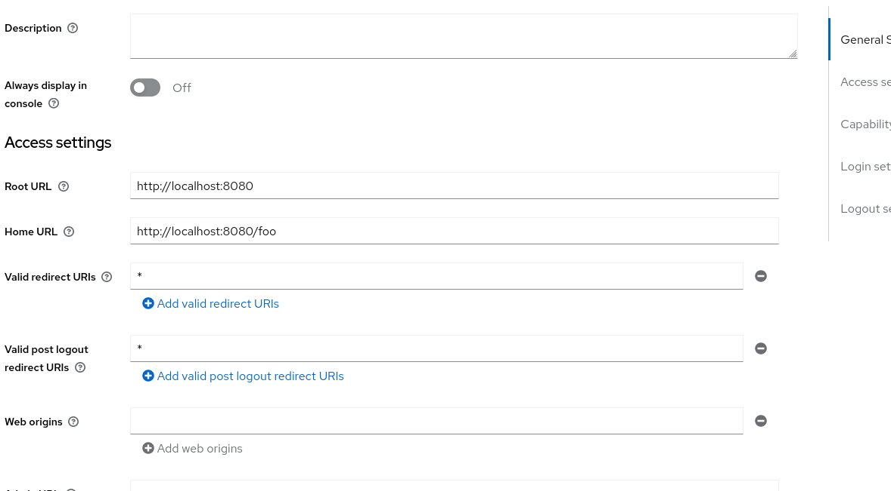

# Example OIDC Setup

This is an exmple using Keycloak as the OIDC provider.

Steps for statring the service and adding an account: 
- starting keycloak: `docker-compose -f keycloak/docker-compose.yml up`
- go to `http://localhost:8989` in your browser and login with admin/admin
- create a new realm in keycloak 
- create a new client in the realm
- add an account in the realm
- set the accounts password under credentials tab

Steps for attaching the application to the OIDC provider:
- copy the `.env.example` file to `.env`
- generate your issuers IP (localhost in this case): `hostname -I | awk '{print $1}'` (THIS MAY CHANGE DEPENDING ON YOUR NETWORK)
- set the `ISSUER` in the `.env` file to the IP
- set the `CLIENT_ID` in the `.env` file to the client id of the client you created in keycloak  (found under `Credentials`)
- set the URL as sen below (VERY BAD PRACTICE, DO NOT DO THIS IN PRODUCTION)
- set the `CLIENT_SECRET` in the `.env` file to the client secret of the client you created in keycloak
- set the `APP_URL` in the `.env` file to `http://localhost:8080`

